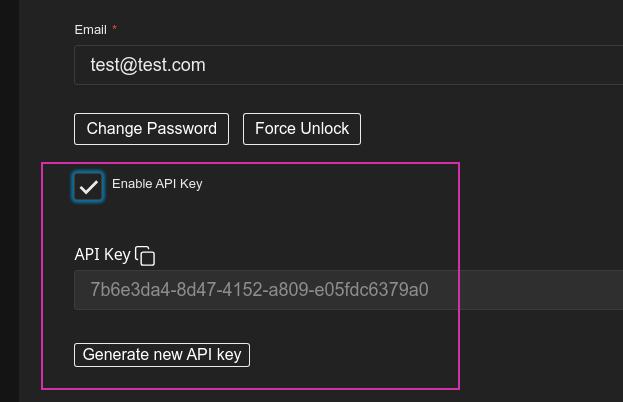
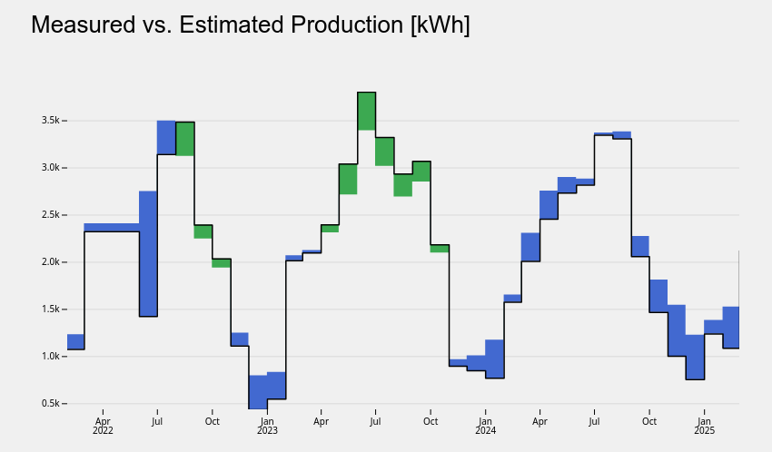
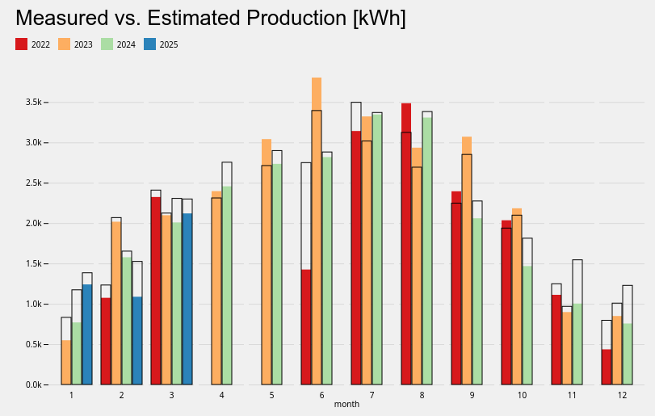
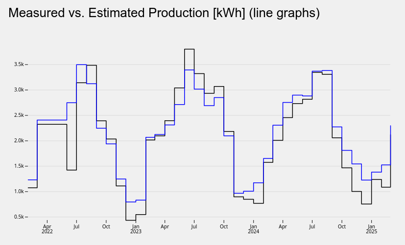
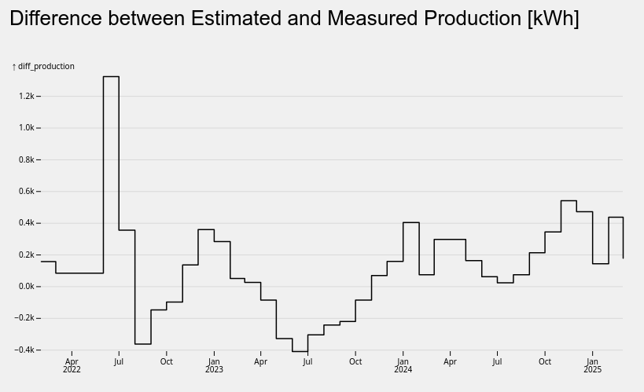
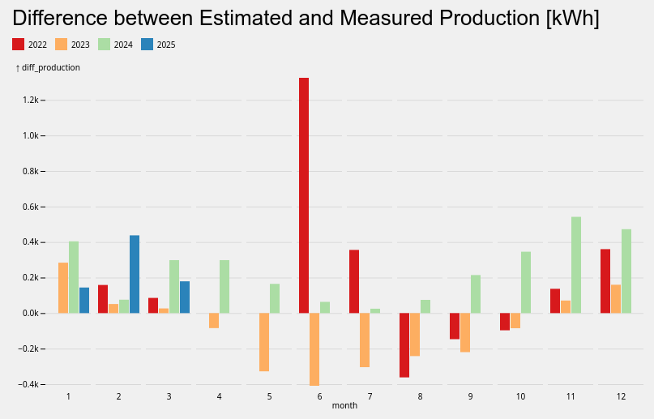
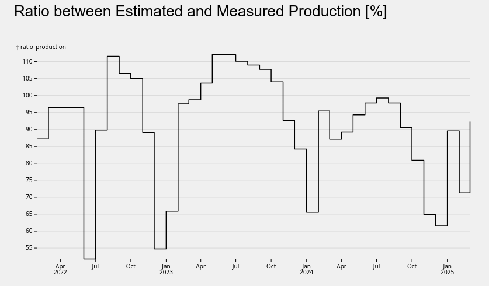
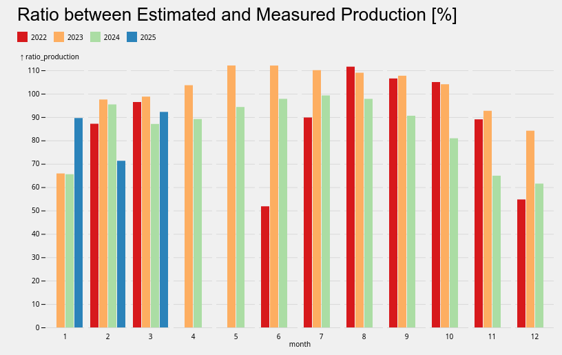

<!-- for main -->

[](https://github.com/tegonal/sun-set-analytics/releases/tag/v0.1.0)
[](https://www.gnu.org/licenses/agpl-3.0.en.html "License")
[](https://github.com/tegonal/sun-set-analytics/actions/workflows/quality-assurance.yml?query=branch%3Amain)
[](https://github.com/tegonal/sun-set-analytics/issues?q=is%3Aissue+is%3Aopen+label%3A%22good+first+issue%22 "Ask in discussions for help")

<!-- for main end -->
<!-- for release -->
<!--
[](https://github.com/tegonal/sun-set-analytics/releases/tag/v0.1.0)
[](https://www.gnu.org/licenses/agpl-3.0.en.html "License")
[](https://github.com/tegonal/sun-set-analytics/issues?q=is%3Aissue+is%3Aopen+label%3A%22good+first+issue%22 "Ask in discussions for help")
-->
<!-- for release end -->

# sun-set-analytics

This project enables users to analyse the degradation of their solar panels over time

---
❗ You are taking a *sneak peek* at the next version. It could be that some features you find on this page are not
released yet.  
Please have a look at the README of the corresponding release/git tag. Latest
version: [README of v0.1.0](https://github.com/tegonal/sun-set-analytics/tree/main/README.md).

---

**Table of Content**

- [Development](#development)
- [Installation](#installation)
- [Documentation](#documentation)
- [Contributors and contribute](#contributors-and-contribute)
- [License](#license)

# Development

> As a pre-requisit, `pnpm` is required. Install it based on https://pnpm.io/installation.

* Copy `src/.env.example` to `src/.env.local` and adjust configuration to your needs.
* run `pnpm i`
* run `pnpm dev`

# Installation

You can start sun-set-analytics based on the published docker image. To start the docker image, you need to

1. Create your own .env configuration as a copy from `.env.example` (i.e. define the app database loaded from `file:///data/sun-set-analytics.db`) 
2. start docker, exposing endpoint and mount writable directory to the location where the sqlite database should be stored: i.e. 
`docker run --rm --env-file .env -p 3000:3000 -v /tmp/:/data/ ghcr.io/tegonal/sun-set-analytics:latest`

# Documentation

## Setup user and installation

On the first start, you first need to create a new user. Based on the role selected, the user has different permissions. A `User` can manage installations and the pv production data of the owned installations. An `Admin` can additionally create new users. 

> Be aware that at the moment no additional check prevents a user to upgrade his role to an `Admin` account

After registering and login to the system, a user can create new installations. The installation will automatically assigned to the current user as owner. Only this user can see and manage the installation afterwards.

## API Key

To be able to use the additional rest API's, the user needs to enable a `API Key` in his profile. 



Read more about the API Strategy in the [payload documentation](https://payloadcms.com/docs/authentication/api-keys).

## Import data

### Upload PV production data

The application provides custom endpoint to be able to upload pv production data. Those data are automatically enriched with data from either 
* [Photovoltaic Geographical Information System (PVGIS) des EU Science Hub](https://joint-research-centre.ec.europa.eu/photovoltaic-geographical-information-system-pvgis_en) or
* [Irradiance data from Open Meteo](https://joint-research-centre.ec.europa.eu/photovoltaic-geographical-information-system-pvgis_en)

based on the availabily and the configuration in the installation (enabled or not).

The upload endpoint expects a json message compatible to  the following json schema:

```json
{
  "$schema": "http://json-schema.org/draft-04/schema#",
  "type": "object",
  "properties": {
    "measured_production": {
      "type": "array",
      "items": [
        {
          "type": "object",
          "properties": {
            "from": {
              "type": "string",
              "format": "datetime"
            },
            "to": {
              "type": "string",
              "format": "datetime"
            },
            "production": {
              "type": "number"
            }
          },
          "required": [
            "from",
            "to",
            "production"
          ]
        }
      ]
    }
  },
  "required": [
    "measured_production"
  ]
}
```

A full example looks like:
```
 curl -H 'Authorization: users API-Key $API_KEY' -X POST $HOSTNAME/api/installations/$INSTALLATION_ID/import-production-data --data '{
  "measured_production": [
    {
      "from": "2022-02-11T20:00:00Z",
      "to": "2022-02-11T21:00:00Z",
      "production": 1.45
    }
  ]
 }'
```
Where you need to provide API_KEY, HOSTNAME and INSTALLATION_ID depending on you setup and provide a valid json payload.

Calling this endpoint will:
1. Enrich and import pv_production data based on the provided time interval
2. Re-Calculate monthly statistics for the given installation and time interval

> Re-importing will not delete any existing records in this time interval. Those need to be cleaned up manually

### Delete pv production data

An additional endpoint allows delete pv production data for an installation an a given time interval. To do so, call the following endpoint:


```
 curl -H 'Authorization: users API-Key $API_KEY' -X POST $HOSTNAME/api/installations/$INSTALLATION_ID/delete-production-data?from=$FROM&to=$TO
```

Where you need to provide API_KEY, HOSTNAME and INSTALLATION_ID depending on you setup and define with FROM and TO as ISO datetime values the time interval to be deleted. This will:

1. Delete pv production data for the given installation and time interval
2. Re-Calculate monthly statistics for the given installation and time interval

### Re-fetch pv production data

An additional endpoint allows re-fetching estimate pv production data for an installation an a given time interval. To do so, call the following endpoint:


```
 curl -H 'Authorization: users API-Key $API_KEY' -X POST $HOSTNAME/api/installations/$INSTALLATION_ID/recalculate-estimated-production?from=$FROM&to=$TO
```

Where you need to provide API_KEY, HOSTNAME and INSTALLATION_ID depending on you setup and define with FROM and TO as ISO datetime values the time interval to be re-fetched. This will:

1. Re-fetch the estimated production data and update the records
2. Re-Calculate monthly statistics for the given installation and time interval

### Re-calculate monthly statistics

To re-calculate the monthly statistics based on the data you can call the following endpoint:
```
 curl -H 'Authorization: users API-Key $API_KEY' -X POST $HOSTNAME/api/installations/$INSTALLATION_ID/recalculate-monthly-stats?from=$FROM&to=$TO
```
Where you need to provide API_KEY, HOSTNAME and INSTALLATION_ID depending on you setup and define with FROM and TO as ISO date values.

## Analyze statistics
After importing pv production data, the monthly statistics can be analyzed based on different comparisons. The following charts should demonstrate the different charts.

### Measured vs. estimated production history



### Measured vs. estimated production history, yearly comparison



### Measured vs. estimated production history, lines



### Difference between estimated measured production history



### Difference between estimated measured production history, yearly comparison



### Ratio between estimated measured production history



### Ratio between estimated measured production history, yearly comparison



## Status of the project

The aim of this project was to provide a basic platform to be able to import. track and compare long term pv production data. The tool was created as an MVP in the context of a tegonal Open Source week in which the whole company tries to contribute to new or existing open source software. There is currently no upcoming work planned on the project. Please share your ideas, experiences or other inputs either [issues](https://github.com/tegonal/sun-set-analytics/issues), [discussions](https://github.com/tegonal/sun-set-analytics/discussions) or direct contributions.

# Contributors and contribute

Our thanks go to [code contributors](https://github.com/tegonal/sun-set-analytics/graphs/contributors)
as well as all other contributors (e.g. bug reporters, feature request creators etc.)

You are more than welcome to contribute as well:

- star this repository if you like/use it
- [open a bug](https://github.com/tegonal/sun-set-analytics/issues/new?template=bug_report.md) if you find one
- Open a [new discussion](https://github.com/tegonal/sun-set-analytics/discussions/new?category=ideas) if you
  are missing a
  feature
- [ask a question](https://github.com/tegonal/sun-set-analytics/discussions/new?category=q-a)
  so that we better understand where we can improve.
- have a look at
  the [help wanted issues](https://github.com/tegonal/sun-set-analytics/issues?q=is%3Aissue+is%3Aopen+label%3A%22help+wanted%22).

# License

sun-set-analytics is licensed under [GNU Affero General Public License v3](https://www.gnu.org/licenses/agpl-3.0.en.html)
